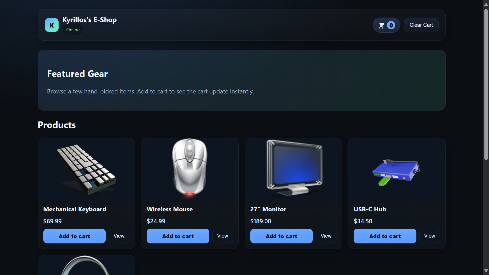
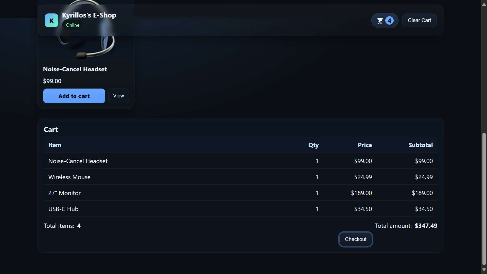

# End-to-End CI/CD Pipeline for Eshop app

## App Screenshots

<p align="center">
	
	
</p>

# Overview

This project provides a modern web application template with a robust, automated CI/CD pipeline. It features automated testing, semantic versioning, Docker image builds, and Kubernetes deployment using Helm—fully orchestrated with GitHub Actions.

---

## Features

- **Express.js API** for products and cart management
- **TypeScript** for type safety
- **Unit testing** with Jest and Supertest
- **Linting** with ESLint and Prettier
- **Semantic Release** for automated versioning and changelog
- **Dockerized** for consistent builds and deployments
- **Helm chart** for Kubernetes deployment
- **GitHub Actions** for CI/CD: test, release, build, and deploy

---

## API Endpoints

- `GET /health` – Status check
- `GET /products` – List products
- `GET /products/:id` – Get a single product
- `POST /products` – Create a product
- `GET /cart` – Get cart contents
- `POST /cart/add` – Add item to cart
- `POST /cart/clear` – Clear the cart
- `POST /cart/checkout` – Simulate checkout

---


## CI/CD Pipeline


### Pre-Merge: Continuous Integration (CI)
All pull requests trigger the CI pipeline, which ensures code quality, security, and reliability before merging:
- Install dependencies
- Lint code
- Run unit tests
- Check code coverage
- Build Docker image
- Scan Docker image for vulnerabilities with Trivy

### Post-Merge: Continuous Delivery (CD)
After merging to the main branch, the CD pipeline automates the release and deployment process:
- Analyze commit messages and determine the next semantic version (semantic-release)
- Tag and publish a new release
- Build and push Docker images (tagged with the new version) to Docker Hub
- Update Helm chart values with the new image tag
- Deploy the updated application to Minikube using Helm

---

## Development

```bash
# Install dependencies
npm ci

# Run in development mode
npm run dev

# Run tests
npm test

# Lint code
npm run lint

# Build for production
npm run build
```

---

## Docker

Build and run the app with Docker:

```bash
docker build -t yourname/eshop:latest .
docker run -p 3000:3000 yourname/eshop:latest
```

---

## Kubernetes & Helm

Customize deployment via `helm-chart/values.yaml`. Deploy with:

```bash
helm upgrade --install eshop ./helm-chart --namespace default --create-namespace
```

---

## Requirements

- Node.js 18+
- 

---